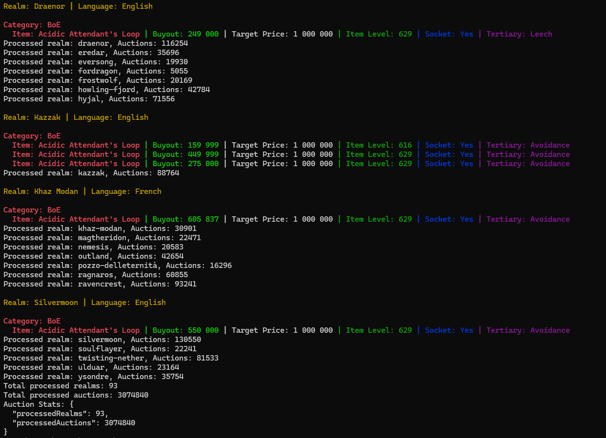
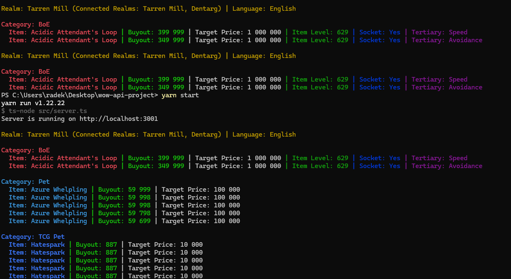
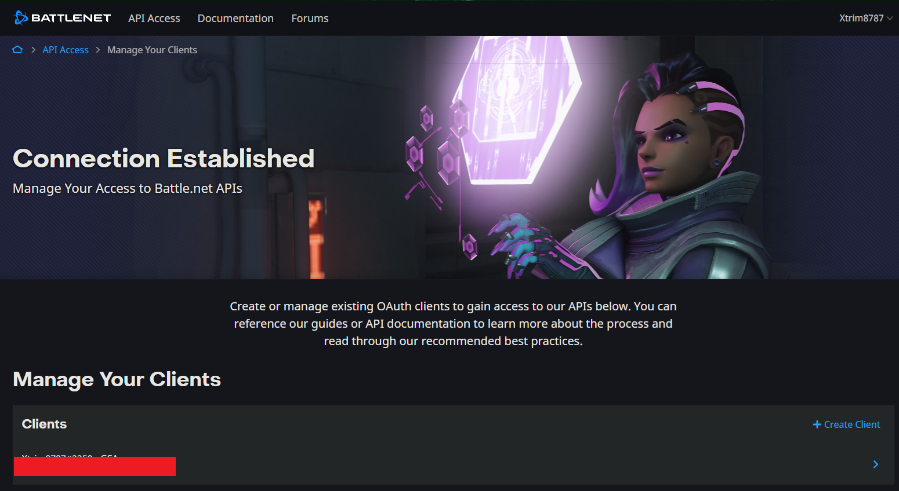
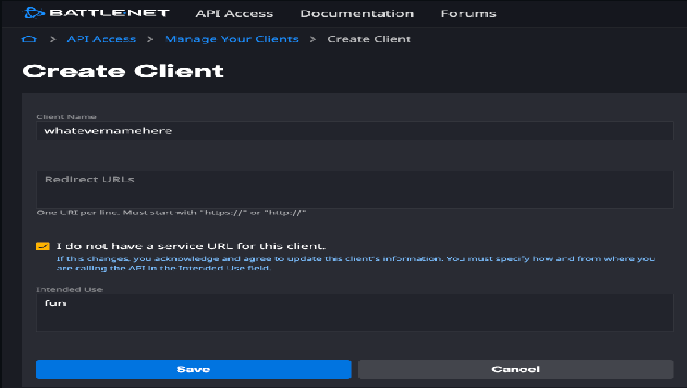
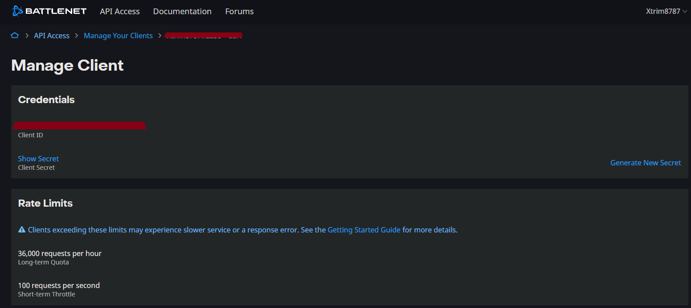

# WoW Auction Scanner

## 🔄 Description

The WoW Auction Scanner is a custom-built tool that interacts with the World of Warcraft (WoW) Auction House API to provide detailed insights into auction data. It includes advanced filtering and analysis options, making it a valuable resource for players interested in tracking and purchasing specific items efficiently.

## 🚀 Features

- **Custom Auction Scanning**: Fetches live auction data for all realms in the EU region.
- **Advanced Filtering**: Includes customizable filters for specific categories like BoE, mounts, pets, and transmog items.
  - This functionality goes beyond what the WoW API offers by allowing custom filters such as minimum item level, socket presence, or tertiary stats.
- **Item Level Decoding**: Uses raw data from [Raidbots](https://www.raidbots.com/developers) to decode and map item levels and bonus IDs, which are not directly provided by the WoW API.
- **Efficiency**: Reduces manual effort by automating the process of scanning multiple realms for items of interest.
- **Dynamic Expansion Support**: Includes support for data updates to align with new WoW expansions.

## 📂 Project Structure

```
├── src
│   ├── config
│   │   └── dotenv.ts
│   ├── controllers
│   │   ├── auctionController.ts
│   │   ├── itemController.ts
│   │   └── realmController.ts
│   ├── data
│   │   ├── items.json
│   │   ├── itemList.ts
│   │   ├── raid_bots.json
│   │   └── realms.ts
│   ├── routes
│   │   ├── auctionRouter.ts
│   │   └── itemRouter.ts
│   ├── services
│   │   ├── auctionService.ts
│   │   ├── authService.ts
│   │   └── itemService.ts
│   ├── types
│   │   ├── auction
│   │   │   └── auction.ts
│   │   ├── realm
│   │   │   └── realm.ts
│   │   ├── index.ts
│   │   └── item.ts
│   ├── utils
│   │   ├── delay.ts
│   │   ├── formatPrice.ts
│   │   ├── helpers.ts
│   │   └── loadJsonFiles.ts
│   └── server.ts
├── public
│   └── images
├── .env.example
├── .gitignore
├── .prettierrc.json
├── eslint.config.mjs
├── package.json
└── tsconfig.json
```

## ⚙️ How It Works

1. **API Integration**: The project uses Blizzard's WoW API to fetch auction data.
2. **Item Data Decoding**: Additional data from Raidbots is used to decode and map item levels and bonus IDs for detailed analysis.
3. **Filtering and Categorization**: The tool filters auctions based on customizable criteria such as item level, socket presence, and target price.
4. **Response and Insights**: Results are displayed in a structured format, allowing users to quickly identify items of interest.

## 🛠️ Tools and Technologies

- **TypeScript** for type-safe code.
- **Express.js** for API routes.
- **Node.js** for server-side logic.
- **dotenv** for environment variable management.
- **Raidbots Data** for decoding item details.
- **Insomnia/Postman** for testing API endpoints.

## 🌟 Unique Functionalities

- **Item Level Decoding**: Unlike the WoW API, which does not provide decoded item levels, this tool integrates data from Raidbots to fill this gap.
- **Custom Filtering**: Supports advanced filtering criteria like BoE-specific attributes, transmog categories, and tertiary stats.

## 🔧 Setup Instructions

1. Clone the repository:
   ```bash
   git clone https://github.com/RadoH87/wow-api-project.git
   ```
2. Navigate to the project directory:
   ```bash
   cd wow-api-project
   ```
3. Install dependencies:
   ```bash
   npm install
   or
   yarn install
   ```
4. Create a `.env` file based on `.env.example` and provide the following details:
   ```env
   CLIENT_ID=your_client_id
   CLIENT_SECRET=your_client_secret
   ```
5. Start the development server:
   ```bash
   yarn dev
   ```

## 📸 Screenshots

### Example Scanning Process




### Blizzard API Setup

1. Go to [Blizzard Developer Portal](https://develop.battle.net/access/clients) and create a client.
2. Fill in the required details as shown below:

   - **Client Name**: Any descriptive name.
   - **Redirect URLs**: Leave blank or set a valid URL if required.
   - **Intended Use**: Select the appropriate use case.
   - Save and copy the `Client ID` and `Client Secret`.

   
   
   

3. Add the `Client ID` and `Client Secret` into your `.env` file.

## 🧪 API Endpoints

### Fetch All Auctions

- **Endpoint**: `GET /api/auctions`
- **Description**: Scans all realms for auction data.
- **Example Response**: Provides filtered auction details based on your custom criteria.

### Fetch Auctions for Specific Realm

- **Endpoint**: `GET /api/auctions/:realmSlug`
- **Description**: Fetches auction data for a specific realm.
- **Example Usage**: Replace `:realmSlug` with the desired realm (e.g., `tarren-mill`).

## 🚀 Future Improvements

- **User Interface**: Add a front-end dashboard for easier interaction.
- **Automated Testing**: Implement unit and integration tests.
- **Global Support**: Expand support to include other WoW regions like US or Asia.
- **Real-Time Updates**: Incorporate WebSocket functionality for real-time auction updates.
- **Enhanced Data**: Add support for more detailed item analytics, historical price tracking, and rate selling demand insights.
- **Database Integration**: Store auction data for long-term analysis and trend evaluation.

## 🤝 Contribution

Feel free to fork the repository, create a branch, and submit a pull request. Contributions and suggestions are always welcome.

## 📜 License

This project is licensed under the MIT License. See the `LICENSE` file for details.

---

**Note**: Ensure to keep the Raidbots data updated to reflect the latest game expansions and item changes.
